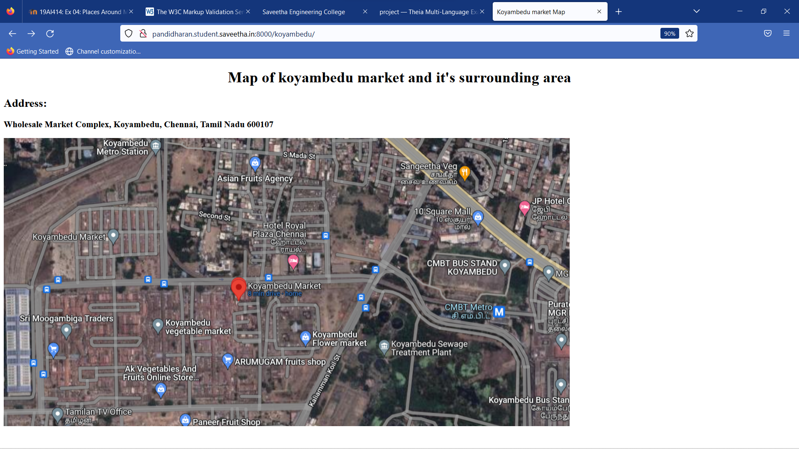
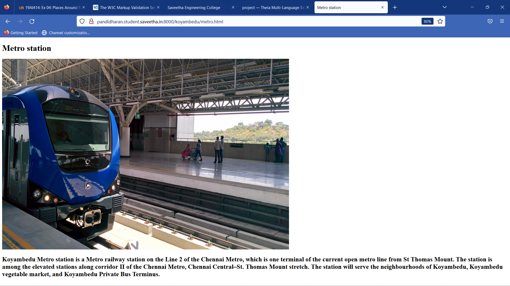
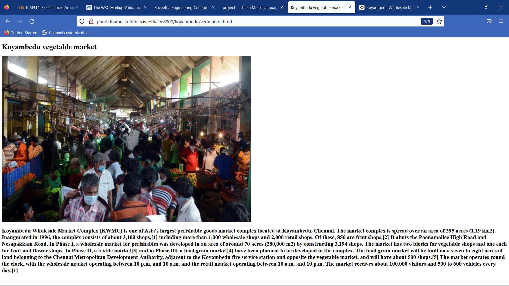
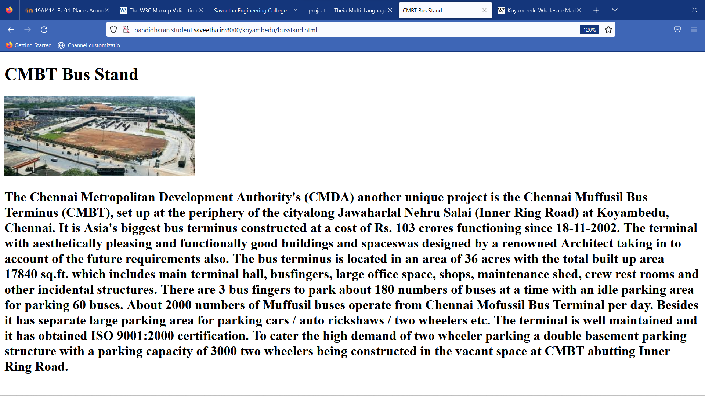
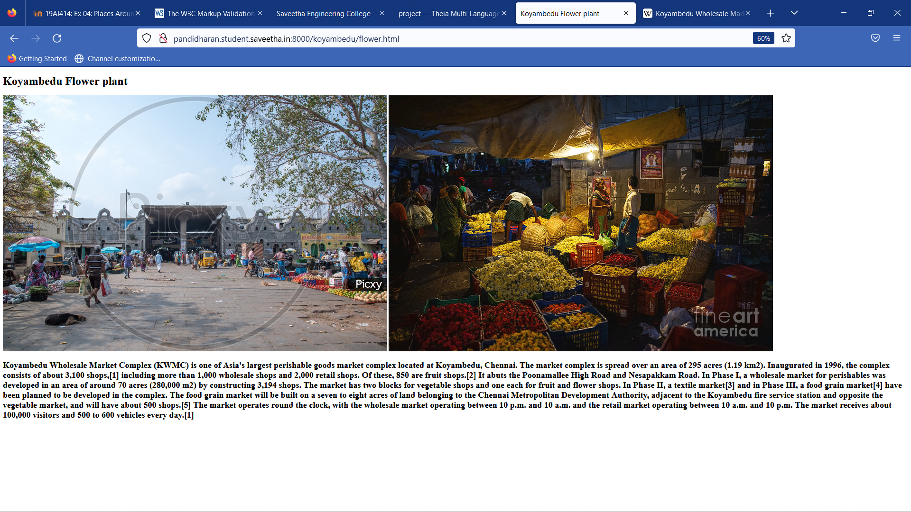
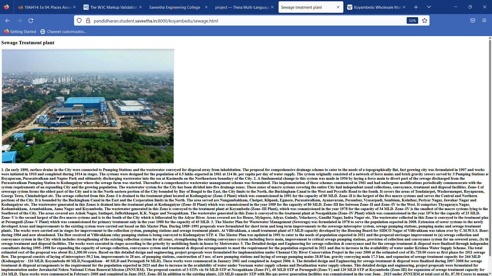

# Places Around Me
## AIM:
To develop a website to display details about the places around my house.

## Design Steps:

### Step 1:
Write your own steps here.
### Step 2:

## Code:
```
<!DOCTYPE html>
<html>
    <head>
        <title>Koyambedu market Map</title>
    </head>
    <body>
        <h1 align='center'> Map of koyambedu market and it's surrounding area</h1>
        <h2  align='left'>Address:</h2>
        <h3 align='left'>Wholesale Market Complex, Koyambedu, Chennai, Tamil Nadu 600107</h3>
        
            <map name="image-map">
                <area title="Metro station" href="metro.html" shape="rect" coords="376,108,151,0">
                <area title="Vegetable market" href="vegmarket.html" shape="rect" coords="84,328,481,559">
                <area title="Sewage Treatment Plant" href="sewage.html" shape="poly" coords="757,392,840,365,880,425,861,494,836,558,816,589,776,611,696,605,639,609,652,583,707,488" >
                <area title="Flower market" href="flower.html" shape="poly" coords="489,329,518,318,766,307,637,559,488,561">
                <area title="CMBT Bus stand" href="busstand.html" shape="poly" coords="914,192,896,227,847,225,828,259,930,339,1108,353,1117,277,1012,184">
            </map>
        
        
</body>
</html>
```

## Output:













## Result:

Thus a website had been developed to display details about the places around my house.